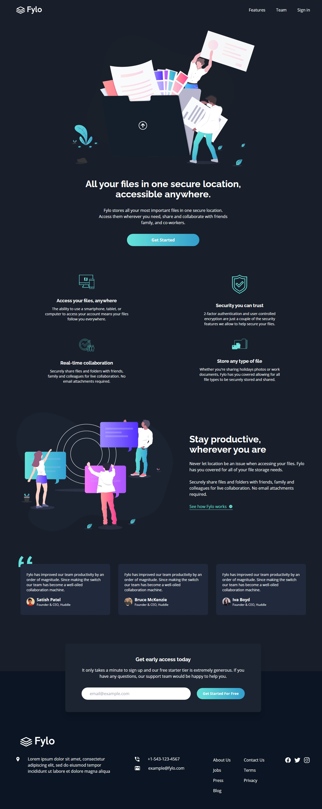
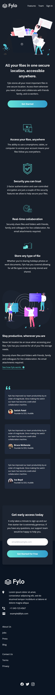

# Frontend Mentor - Fylo dark theme landing page solution

This is a solution to the [Fylo dark theme landing page challenge on Frontend Mentor](https://www.frontendmentor.io/challenges/fylo-dark-theme-landing-page-5ca5f2d21e82137ec91a50fd). Frontend Mentor challenges help you improve your coding skills by building realistic projects.

## Table of contents

- [Overview](#overview)
  - [The challenge](#the-challenge)
  - [Screenshot](#screenshot)
  - [Links](#links)
- [My process](#my-process)
  - [Built with](#built-with)
  - [What I learned](#what-i-learned)
  - [Continued development](#continued-development)
  - [Useful resources](#useful-resources)
- [Author](#author)

## Overview

### The challenge

Users should be able to:

- View the optimal layout for the site depending on their device's screen size
- See hover states for all interactive elements on the page

### Screenshot

## Links

- Live Site - [@superbreezy007](https://www.williamssam.github.io/flyo-dark)

## Built With

- Tailwind CSS

### What I learned

I tested my knwoledge in tailwindcss by building this big layout. I learnt how to use greadient and grid utility in tailwind.

And also learnt how to extend tailwind functionalities.

### Continued development

Am happy with my progress with this framework and I hope to build a more larger layout with it and try other utility features.

### Useful resources

- [Tailwind Documentation](https://tailwindcss.com/docs) - This helped me in everything tailwind

## Author

- Website - [Williams Samuel]
- Frontend Mentor - [@superbreezy007](https://www.frontendmentor.io/profile/superbreezy007)
- Twitter - [@williams_codes](https://www.twitter.com/williams_codes)
